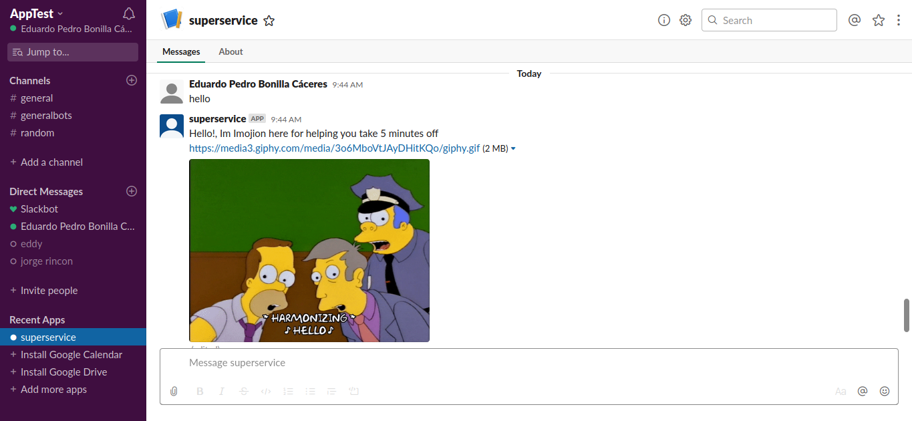
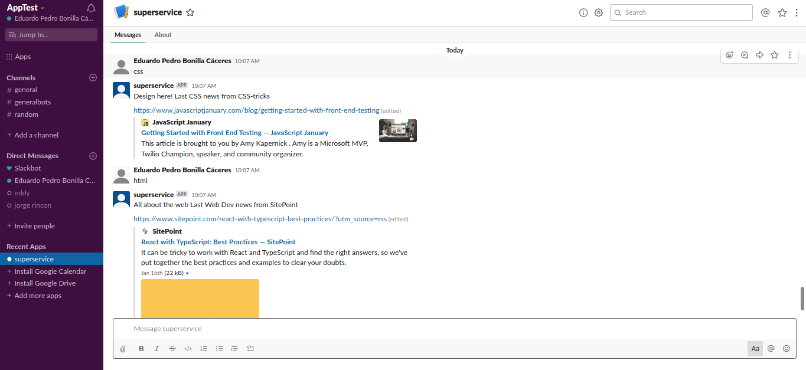
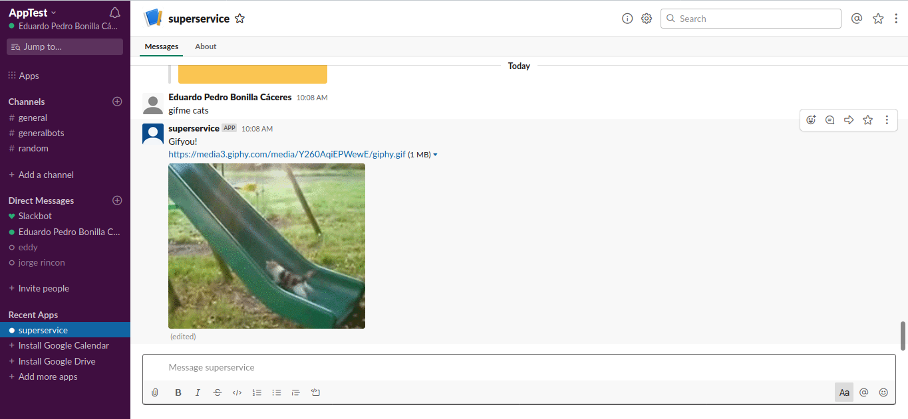

 

  

  <h3 align="center">Imojion Slack Ruby bot</h3>

  

    Take 5 minutes off reading the latest articles and news about the programming languages that you love with a super fun GiphyClient integration
     
    <a href="https://www.notion.so/Build-your-own-bot-ebd0d7ac5da240e5987720bdc83f38fa"><strong>Project Specs »</strong></a>
     
     
  

<!-- TABLE OF CONTENTS -->
## Table of Contents

* [About the Project](#about-the-project)
  * [Built With](#built-with)
  * [Installation](#installation)
* [Usage](#usage)
* [Contact](#contact)

<!-- ABOUT THE PROJECT -->
## About The Project

Imojion bot helps you take 5 minutes off in your slack workspace

Features
* Type a programming language and recieve the latest news from a trusted rss feed
* Get quick gifs for releiving stress :smile:

### Built With
Project built in Ruby under SlackAPI
* [Ruby](https://www.ruby-lang.org/en/)
* [SlackAPI](https://api.slack.com/)
* [Slack-ruby-bot](https://github.com/slack-ruby/slack-ruby-bot)
* [GiphyAPI](https://developers.giphy.com/)

## Getting Started

Install ImojionBot on your Slack workspace in one click

## Installation
### Install Imojiboton your Slack Workspace

1. Create a new Slack workspace or connect to an existing one [Here- Slack workspace create](https://slack.com/create)
2. Create a new slack app on [SlackAPI Apps](https://api.slack.com/apps)
3. In SlackAPI YourNewAPP go to Features > Bot User > Add Bot User and save changes
4. In SlackAPI YourNewAPP go to Settings > Install your app  > Select workspace
5. In SlackAPI YourNewAPP go to Features > Oauth & Permissions > Copy Bot User Oauth Token
6. Clone this remote repo [ImojionBot Review Branch](https://github.com/Usagib/Slack-ImojionBot/tree/bot_deploy)
7. Change Bot User Oauth (not to be confused wuth Oauth Token) token in .env file under SLACK_API_TOKEN (SLACK_API_TOKEN=xxxxx-xxx)
8. Navigate to your Bot directory in your Terminal
9. Run the following commands on terminal
10. $ gem install bundler
11. $ bundle
12. $ rackup
13. terminal should #INFO -- : Successfully connected team YourSlack (TSXXXXXXX) to https://YourSlack-xxxxx.slack.com.
14. Click on the link to go to the Slack workspace with the installed app
14. Enjoy ImojionBot!

## Screenshots

## Usage

Available commands for ImojionBot:

- Imojionbot gifme (keyword) : use to generate automatic gifs!
I.E. @imojionbot gifme cats : will show you a cat gif

Be sure you have the required workspace permissions
This is a giphyclient slack integration, see more at: [GiphyAPI](https://developers.giphy.com/)

## use the following commands to get inmmediate articles on your prefered topic
- ImojionBot cpp
- ImojionBot css
- ImojionBot html
- ImojionBot java
- ImojionBot javascript
- ImojionBot news
- ImojionBot python
- ImojionBot ruby

## Contact

Project Link: [https://github.com/Usagib/Slack-ImojionBot](https://github.com/Usagib/Slack-ImojionBot)
Eduardo Bonilla [https://github.com/UsagiB](https://github.com/UsagiB)
